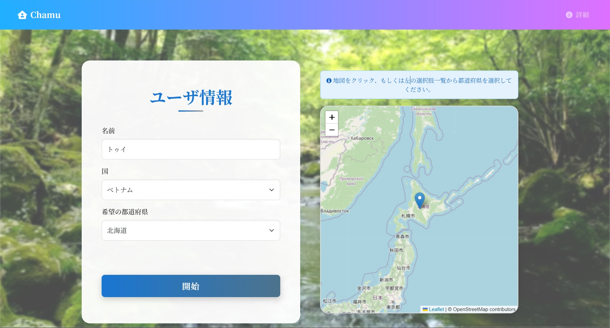
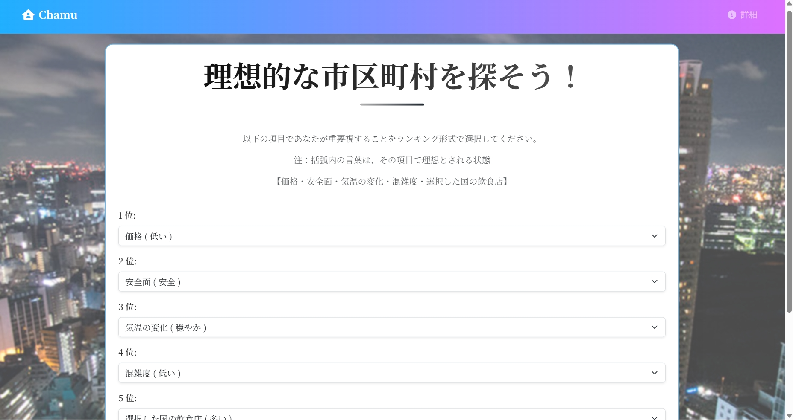
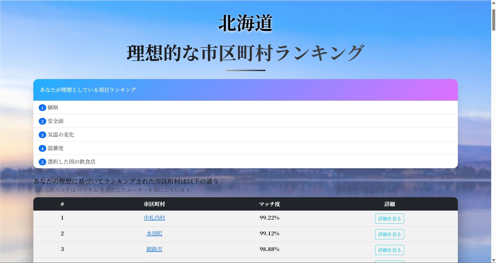
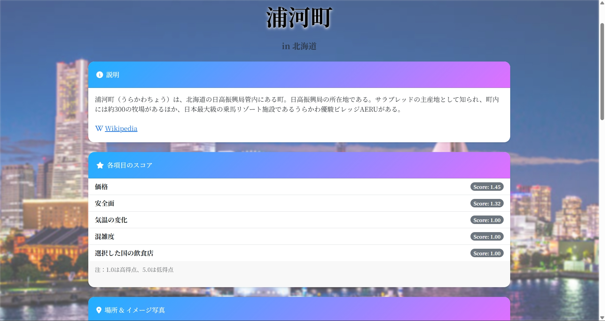
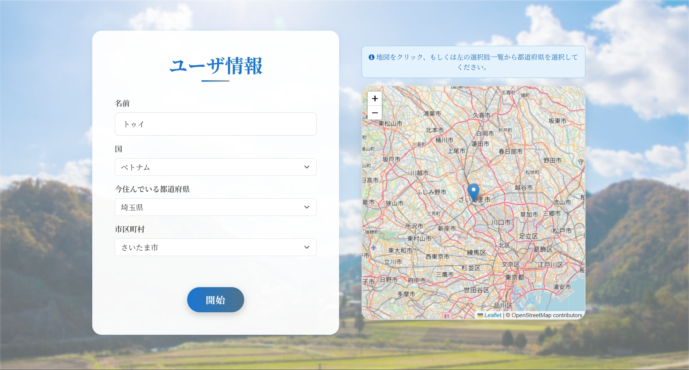
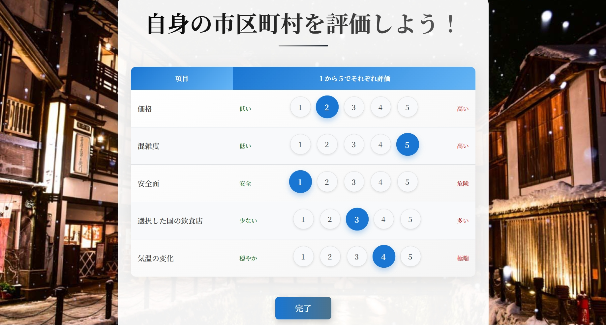
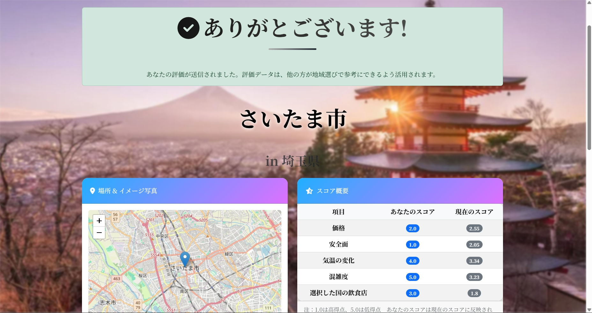
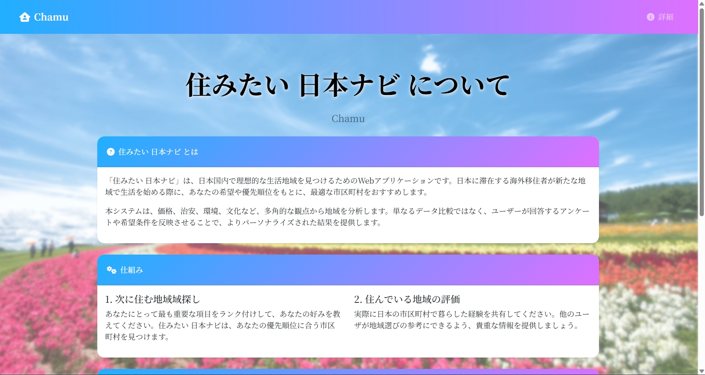

# 🏠 住みたい日本ナビ (Sumitai Nihon Navi) - Japan Housing Navigator

[](https://www.python.org/downloads/)
[](https://www.djangoproject.com/)
[](https://sqlite.org/)
[](https://folium.readthedocs.io/)
[](https://wikipedia.org/)

🌍 A comprehensive web application designed to help foreign residents who want to move and find new places to live in Japan through intelligent matching algorithms and community-driven evaluations.

⚠️ **Project Status**: This is an **educational prototype project** developed for Global Project-Based Learning (gPBL) 2025.  
Not intended for commercial or production use.

---

## 🌟 Features
- 🎯 Smart Location Matching (weighted scoring algorithm)  
- 🗺️ Interactive Map Interface (Folium)  
- 👥 Community Evaluation System (evaluates municipalities on 5 criteria: **Price, Population Density, Crime Rate, Cultural Food Availability, and Temperature**)
- 🌏 Cultural Customization by nationality  
- ⚡ Real-time Score Updates (objective + subjective feedback)  

---

## ⚙️ Scoring Algorithm

Our scoring system is built on a multi-layered approach for reliable and personalized recommendations.

### 1. Final Score
**Combines objective data with community feedback:** 

`Final Score = (Base Score × 0.6) + (User Reviews Average × 0.4)`

### 2. Matching Score
**Customizes results based on user priorities:**

`Matching Score = Σ(Individual Score × Priority Weight) / Total Weight`


### 3. Match Percentage
**Converts the final score into a clear percentage:**

`Match Percentage = ((Max Score - User Score) / Score Range) × 100%`

---

## 📸 Demo / Screenshots
### Matching Flow Views
<p float="left">
  
  
  
</p>

<p float="left">
  
  
</p>

### Evaluation Flow Views
<p float="left">
  
  
  
</p>

### Other
<p float="left">
  
</p>

---

## 🚀 Getting Started

### Prerequisites
```bash
Python 3.8+
pipenv
Git
```

### Installation

1. **Clone the repository**
```bash
git clone https://github.com/yourusername/sumitai-nihon-navi.git
cd sumitai-nihon-navi
```

2. **Install dependencies with pipenv**
```bash
pipenv install
```

3. **Run the development server**
```bash
pipenv run python manage.py runserver
```

Then visit: [http://127.0.0.1:8000/](http://127.0.0.1:8000/)

---

## 📱 Usage

### Matching Flow 🏠➡️🏠
1. Input personal information  
2. Rank evaluation criteria by importance  
3. View matched municipalities with compatibility scores  
4. Explore municipality details (Wikipedia, map, breakdowns)  

### Evaluation Flow 🤝📊
1. Input your current location info  
2. Rate your area (1–5 stars per criterion)  
3. Compare with community averages  
4. Contribute to improve recommendations  

---

## ⚠️ Known Issues / Limitations
- No authentication system yet (anonymous usage)  
- Limited evaluation criteria (only 5 basic ones)  
- Data sources limited to Wikipedia + manual input  
- No weather/transport API integration yet  
- Prototype UI – not optimized for production  

---

## 👥 Development Team  
**Team Chamu** 
- **孫　美結** (Son Miyu)  
- **青木　恵** (Aoki Megumi)  
- **Thái Mỹ Anh**  
- **Nguyễn Thanh Thủy**  

---

## 🔮 Future Roadmap
- 🌐 Multi-language Interface (English, Vietnamese)  
- 📧 Gmail OAuth2 login  
- 🕷️ Web scraping + Google Maps API  
- 📚 More evaluation criteria (education, healthcare, transport)  
- 📱 Mobile App (React Native / Flutter)  
- 🏠 Real Estate integration  
- 🚌 Transport & commute time analysis  
- 💬 Community comments  
- 🤖 Machine Learning for recommendations  
- 📊 Live data feeds (weather, events, news)  

---

## 📄 License
This project is not licensed for commercial use. It is for **educational purposes only**.

---

## 📬 Contact
For questions or feedback, please contact us via GitHub Issues:  
👉 [GitHub Repository](https://github.com//sumitai-nihon-navi)

---

**Made with ❤️ by Team Chamu - Bridging cultures through technology**
